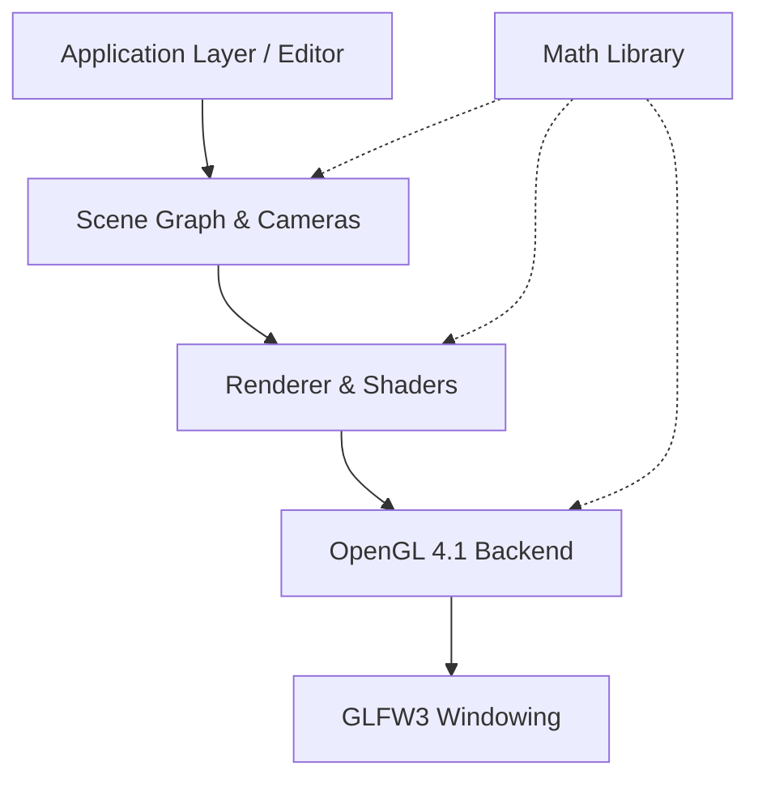

<div align="center">


# 🚀 Sonorlax Engine
**A Go-based 3D render engine and editor built from scratch.**

[](https://golang.org/)
[](https://www.opengl.org/)
[](https://microsoft.com/)
[](LICENSE)

</div>

---

## ✨ Features

- **🎮 OpenGL 4.1 Backend**: Fast, reliable, and modern graphics rendering API.
- **🌳 Scene Graph Architecture**: Hierarchical Node/Transform system for complex scene management.
- **🧮 Custom Math Library**: Zero-dependency `Vec2`, `Vec3`, `Vec4`, `Mat4`, and `Quaternion` implementations natively in Go.
- **🎥 Camera System**: Perspective prediction, look-at functionality, and a free-look (WASD + Mouse) controller.
- **🛠️ Built-in Editor**: An interactive editor framework with selection, raycasting, undo/redo, and visual gizmos.
- **🔶 Primitive Shapes**: Out-of-the-box support for Cube, Sphere, Cylinder, Cone, Pyramid, Torus, and Plane meshes.
- **💡 Lighting**: Basic directional lighting and configurable ambient properties.
- **📊 Debug OVERLAY**: Real-time FPS monitoring, position tracking, and camera angles displayed directly on screen.

---

## 🏗️ Architecture Layers

The engine is cleanly divided into decoupled packages, ensuring maintanibility and extensibility.



### 🗂️ Project Structure

- `math/` - High-performance Vector, Matrix, and Quaternion operations.
- `core/` - Core layout types (Vertex, Color, Transform, Window).
- `opengl/` - OpenGL 4.1 graphics API wrapper (via `go-gl`).
- `renderer/` - High-level rendering abstraction (Shaders, Material bindings).
- `scene/` - Scene graph, mesh primitives, and camera logic.
- `editor/` - Interactive editing tools, raycasting, and user input handling.
- `examples/` - Demonstration applications and usage examples.

> **Note**: A legacy Vulkan backend exists in the repository for reference purposes, but the active rendering pipeline utilizes OpenGL 4.1.

---

## 🚀 Getting Started

### Prerequisites

To build the engine, you will need:
- **Go 1.21** or newer
- **C compiler** (MinGW-w64 or Visual Studio on Windows) for CGO support
- **GLFW3** development libraries

### Windows Setup

The engine is currently highly optimized for Windows development using MSVC or MinGW.

1. Ensure Go is installed and in your system PATH.
2. Clone the repository.
3. Use the provided build script from a developer command prompt:

```batch
build.bat
```

> Or build directly with Go:
> ```bash
> go build ./...
> ```

---

## 💻 Usage Example

Creating a basic scene with a rotating 3D object is simple and intuitive:

```go
package main

import (
    "render-engine/core"
    "render-engine/opengl"
    "render-engine/renderer"
    "render-engine/scene"
)

func main() {
    // 1. Initialize Window
    window, _ := core.NewWindow(core.DefaultWindowConfig())
    defer window.Destroy()
    
    // 2. Initialize Render Engine
    backend := opengl.NewBackend()
    engine, _ := renderer.NewRenderEngine(window, backend)
    defer engine.Destroy()
    
    // 3. Setup Scene & Camera
    s := scene.NewScene()
    camera := scene.NewCamera(1.0472, 16.0/9.0, 0.1, 1000.0)
    s.SetCamera(camera)
    
    // 4. Add Objects
    cube, _ := scene.CreateCube()
    node := scene.NewNode("MyCube")
    node.Mesh = cube
    s.AddNode(node)
    
    engine.SetScene(s)
    
    // 5. Main Loop
    for !window.ShouldClose() {
        window.PollEvents()
        
        // Rotate the cube slowly
        node.Rotate(math.Vec3Up, 0.01)
        
        engine.Render()
    }
}
```

---

## 🗺️ Roadmap

The engine is actively under development. Upcoming features include:

- [ ] **ImGui Integration**: Professional debug UI for the editor.
- [ ] **Asset Pipeline**: Loading PNG/JPG textures, and GLTF/GLB 3D models.
- [ ] **Material System**: Physically Based Rendering (PBR) workflows.
- [ ] **Advanced Lighting & Shadows**: Directional shadows, point lights, and environment mapping.
- [ ] **Post-Processing**: Bloom, HDR tone mapping, and SSAO.

Check out `plan.md` for the complete development roadmap!

---

## 📄 License & Acknowledgments

This project is licensed under the **MIT License**.

- Graphics API bindings via [go-gl/gl](https://github.com/go-gl/gl)
- Windowing via [go-gl/glfw](https://github.com/go-gl/glfw)
